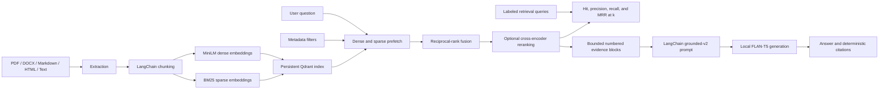

# Production-Minded RAG Pipeline

An end-to-end Retrieval-Augmented Generation pipeline for question answering
over business documents. The project uses LangChain, Hugging Face models, and a
persistent local Qdrant vector store to turn PDF, DOCX, Markdown, HTML, and text
files into grounded answers with deterministic source citations.

The implementation starts with a local, reproducible baseline while preserving
the contracts needed to evolve toward hosted models, production APIs,
evaluation, observability, and enterprise data sources.

## Development Approach

This project was developed using AI-assisted software engineering with Codex. I
used AI as a development partner for implementation support while defining the
architecture, requirements, tests, and design decisions myself. All generated
code was reviewed, adapted, and validated through automated tests.

## Highlights

- Multi-format ingestion and extraction for PDF, DOCX, Markdown, HTML, and text
- Configurable recursive chunking with page and character-level provenance
- Reproducible chunking experiments with distribution and overlap-cost metrics
- Local normalized MiniLM embeddings through LangChain
- Optional local BM25 sparse embeddings with native Qdrant RRF hybrid search
- Optional local cross-encoder reranking with first-stage score provenance
- Persistent Qdrant storage with deterministic IDs and idempotent upserts
- Collection compatibility checks for embedding model, vector dimension,
  distance metric, and schema version
- Ranked semantic retrieval with configurable top-k and score thresholds
- Typed exact-match metadata filters pushed into Qdrant before top-k selection
- Versioned retrieval evaluation datasets with per-query and macro top-k metrics
- Tokenizer-bounded local generation with a versioned grounding and abstention
  prompt
- Deterministic citations built from retrieval metadata, never model output
- Typed configuration, stage-specific exceptions, and automated tests

## Architecture



## Engineering Decisions

| Decision | Production rationale |
| --- | --- |
| Preserve provenance during extraction and chunking | Citations cannot be reconstructed reliably after metadata is lost. |
| Compare chunking candidates on one document snapshot | Keeps input variance from being mistaken for a chunking effect. |
| Use deterministic chunk IDs | Re-indexing updates logical chunks instead of creating duplicates. |
| Record collection model and dimension | Incompatible query vectors fail before corrupting retrieval behavior. |
| Version dense and hybrid collection schemas separately | Prevents queries from silently using collections that do not contain the required sparse vectors. |
| Fuse dense and sparse ranks with RRF | Combines semantic and exact-term retrieval without mixing incomparable raw scores. |
| Push metadata filters into Qdrant | Selects top-k only from eligible chunks and avoids leaking excluded candidates into application code. |
| Overfetch before optional cross-encoder reranking | Lets the first stage optimize recall while the second stage improves precision without scoring the entire corpus. |
| Preserve first-stage rank and score after reranking | Keeps retrieval behavior auditable and avoids presenting incomparable scores as one metric. |
| Evaluate exact metadata relevance labels at a fixed cutoff | Makes retrieval regressions measurable without involving nondeterministic answer generation. |
| Skip generation without evidence | Avoids unnecessary inference and unsupported answers. |
| Version the generation prompt and return its identifier | Makes answer behavior reproducible across evaluation runs, deployments, and incident analysis. |
| Delimit and number retrieved evidence independently of citations | Gives the model clear evidence boundaries while citation records remain deterministic application data. |
| Budget the complete prompt with the model tokenizer | Prevents input overflow while keeping citations aligned with the exact evidence sent. |
| Build citations outside the LLM | Prevents fabricated filenames, pages, and source identifiers. |
| Keep provider boundaries behind LangChain interfaces | Makes later model and infrastructure changes less invasive. |

## Quick Start

Requirements:

- Python 3.11 or newer
- [uv](https://docs.astral.sh/uv/)

Install the locked environment:

```powershell
uv sync
```

Index one file or an entire directory:

```powershell
uv run python -m rag_pipeline index path/to/documents
```

Ask a question against the persisted collection:

```powershell
uv run python -m rag_pipeline answer "Which vector database does this project use?"
```

Use separate collection names for unrelated corpora. For example, index an
expense-policy corpus with `--collection-name expense_policies` and pass the
same option to `retrieve` and `answer`; local Qdrant collections persist across
commands.

The first embedding, reranking, and generation runs download their configured
Hugging Face model weights when those stages are enabled. Public local models
do not require an API key.

## Example Output

```text
Answer:
The project uses a persistent local Qdrant vector store.

Sources:
[1] README.md (chunk 3, characters 1740-2050)
    The local prototype stores vectors in Qdrant under .rag_data/qdrant...
```

Citation records also retain the stable chunk ID, retrieval rank, and retrieval
score for programmatic use. Scores are intentionally not presented as answer
confidence values.

## CLI Workflow

```powershell
# Inspect supported commands
uv run python -m rag_pipeline -h

# Load supported documents
uv run python -m rag_pipeline ingest path/to/documents

# Inspect chunk counts
uv run python -m rag_pipeline chunk path/to/documents

# Compare several chunking configurations without model calls or indexing
uv run python -m rag_pipeline chunk-experiment path/to/documents --candidate 500:100 --candidate 1000:200 --candidate 1500:300

# Verify local embedding output
uv run python -m rag_pipeline embed path/to/documents

# Build or update the persistent Qdrant collection
uv run python -m rag_pipeline index path/to/documents

# Build a separate dual-vector collection for hybrid search
uv run python -m rag_pipeline index path/to/documents --collection-name policies_hybrid --search-mode hybrid

# Inspect ranked evidence without generation
uv run python -m rag_pipeline retrieve "What is the policy?" --top-k 3

# Retrieve 20 candidates, then return the best 3 after local reranking
uv run python -m rag_pipeline retrieve "What is the policy?" --rerank --candidate-k 20 --top-k 3

# Restrict retrieval before semantic top-k selection
uv run python -m rag_pipeline retrieve "What is the policy?" --filter file_extension=.pdf

# Evaluate ranked retrieval against labeled queries without generation
uv run python -m rag_pipeline evaluate-retrieval retrieval-evaluation.json --top-k 5

# Retrieve evidence and generate a cited answer
uv run python -m rag_pipeline answer "What is the policy?" --top-k 3
```

Useful options include:

- `--model` and `--model-revision` for the embedding model
- `--generation-model` and `--generation-model-revision` for the local LLM
- `--device` and `--generation-device` for CPU or CUDA placement
- `--top-k` and `--score-threshold` for retrieval behavior
- `--rerank` and `--candidate-k` for optional second-stage reranking
- `--reranker-model`, `--reranker-model-revision`, `--reranker-device`,
  `--reranker-cache-dir`, `--reranker-batch-size`, and
  `--reranker-max-length` for the local cross-encoder
- `--search-mode dense|hybrid` for the collection and retrieval strategy
- `--sparse-model`, `--sparse-cache-dir`, `--sparse-batch-size`, and
  `--sparse-threads` for local hybrid indexing and queries
- repeatable `--filter KEY=VALUE` for exact metadata filters with AND semantics
- repeatable `--candidate SIZE:OVERLAP` for chunking experiments
- `--output-format table|json` for human or machine-readable experiment and
  evaluation reports
- `--max-input-tokens` for an optional limit below the tokenizer model maximum
- `--max-context-characters` as a secondary generation context guard
- `--collection-name` and `--store-path` for Qdrant persistence

## Chunking Experiments

The `chunk-experiment` command materializes one document snapshot and runs every
candidate against that same input. With no `--candidate` options, it compares
`500:100`, `1000:200`, and `1500:300`; each pair represents maximum chunk
characters and target overlap characters.

The report includes chunk count, min/mean/p95/max chunk length, total emitted
characters, and duplicated characters. Duplication is calculated from the
actual provenance intervals emitted by LangChain, because separator-aware
splitting does not always produce the configured overlap exactly. Chunk count
and total characters are useful cost proxies; the length distribution exposes
undersized tails and context pressure.

Use JSON when recording or comparing runs:

```powershell
uv run python -m rag_pipeline chunk-experiment path/to/documents --output-format json
```

These are structural diagnostics, not retrieval-quality scores. A candidate
with fewer chunks or less duplication is not automatically better. Use the
retrieval evaluator below to compare candidates with representative queries and
relevance labels; Task 18 will add latency and broader benchmark reporting.

## Retrieval Evaluation

The `evaluate-retrieval` command measures an existing collection without
calling the generation model or modifying the index. It reuses the same dense
or hybrid retrieval, exact metadata filters, score threshold, and optional
cross-encoder reranking as `retrieve` and `answer`.

Evaluation datasets are UTF-8 JSON with a strict, versioned schema:

```json
{
  "schema_version": 1,
  "name": "expense-policies-v1",
  "cases": [
    {
      "id": "itemized-receipts",
      "query": "What evidence is required for an expense claim?",
      "relevant": [
        {
          "file_name": "expense-policy.pdf",
          "page": 2,
          "chunk_index": 0
        }
      ]
    }
  ]
}
```

Each object under `relevant` is an exact metadata selector: every listed field
and value must match a returned LangChain document. `page` and `chunk_index`
use the zero-based values stored in Qdrant. Use an application-level stable
`document_id` when datasets must survive file renames or path changes; the
current `chunk_id` remains stable only while source provenance is unchanged.
Each selector should identify one distinct relevant chunk as narrowly as
possible. Broad selectors can match several chunks and make precision look more
optimistic than the underlying evidence quality.

```powershell
uv run python -m rag_pipeline evaluate-retrieval retrieval-evaluation.json `
  --collection-name expense_policies `
  --top-k 5 `
  --output-format json
```

The report includes these binary metrics at the selected cutoff:

- **Hit@k:** `1` when at least one relevant chunk is returned, otherwise `0`.
- **Precision@k:** relevant returned chunks divided by `k`; missing result slots
  caused by filtering or thresholds count as misses.
- **Recall@k:** relevance selectors matched by at least one returned chunk,
  divided by all selectors for that query.
- **RR@k / MRR@k:** reciprocal rank of the first relevant chunk for each query,
  or `0` for a miss; MRR is the macro average across queries.

Aggregate values are macro averages, so every query has equal weight. The JSON
format is suitable for saving results; Task 17 will add representative project
datasets and Task 18 will add reproducible benchmark comparisons and runtime
measurements.

## Metadata Filters

Both `retrieve` and `answer` accept repeatable exact-match filters. Conditions
are translated into structured Qdrant payload filters and applied before
semantic top-k selection:

```powershell
uv run python -m rag_pipeline answer "What is the policy?" `
  --filter file_extension=.pdf `
  --filter page=0
```

Repeated filters use AND semantics. Unquoted integers and lowercase JSON
booleans are typed automatically, while other unquoted values remain strings.
Use a quoted JSON string when a numeric-looking value must stay a string:

```powershell
uv run python -m rag_pipeline retrieve "Find policy 001" --filter 'policy_version="001"'
```

Automatically indexed fields include `source`, `file_name`, `file_stem`,
`file_extension`, `byte_size`, `extractor`, and, for PDFs, zero-based `page` and
`total_pages`. The same API supports custom scalar metadata added to LangChain
documents programmatically. A missing field or unmatched value produces no
eligible chunks; the `answer` command then abstains before loading the LLM.

Metadata filters improve relevance but are not an authorization system by
themselves. A production API must inject mandatory tenant and ACL constraints
server-side so callers cannot omit or replace them, and frequently filtered
fields should receive Qdrant payload indexes at scale.

## Hybrid Search

Dense search remains the default and existing schema-v1 collections continue to
work unchanged. Hybrid mode creates a schema-v2 collection containing named
MiniLM dense vectors and BM25 sparse vectors. Use a separate collection name
and pass the same mode to indexing and retrieval:

```powershell
uv run python -m rag_pipeline index path/to/documents `
  --collection-name policies_hybrid `
  --search-mode hybrid

uv run python -m rag_pipeline retrieve "What does code ZX-42 require?" `
  --collection-name policies_hybrid `
  --search-mode hybrid
```

The first hybrid command downloads the configured FastEmbed sparse model into
`.rag_data/fastembed`; it runs locally afterward and needs no API key. Qdrant's
IDF modifier is part of the hybrid collection schema. At query time LangChain
prefetches dense and sparse candidates, applies the same metadata filters to
both branches, and asks Qdrant to combine ranks with reciprocal-rank fusion.
Queries that produce an empty sparse vector safely fall back to the collection's
dense vector.

CLI results expose `score_kind=cosine` or `score_kind=rrf`. These scores are not
interchangeable: dense thresholds are based on cosine similarity, while hybrid
thresholds apply to the fused rank score. Calibrate each mode independently on
a representative evaluation dataset. The default `Qdrant/bm25` model favors
English tokenization and stemming; multilingual or domain-specific corpora may
need a different sparse model.

Attempting hybrid retrieval against an existing dense collection fails closed.
This is intentional: adding a sparse field does not populate old points, so the
documents must be reindexed into a hybrid collection before fusion is valid.

## Cross-Encoder Reranking

Reranking works after either dense or hybrid retrieval and does not require
reindexing. The first stage retrieves a wider candidate set, then the local
cross-encoder scores each query-chunk pair jointly and returns the final
`--top-k` results:

```powershell
uv run python -m rag_pipeline retrieve "What does code ZX-42 require?" `
  --collection-name policies_hybrid `
  --search-mode hybrid `
  --rerank `
  --candidate-k 20 `
  --top-k 4
```

The first reranked query downloads
`cross-encoder/ms-marco-MiniLM-L6-v2` into `.rag_data/rerankers`. It then runs
locally through Sentence Transformers and needs no API key. The model scores
all candidates in batches, with a maximum tokenized query-chunk length of 512
by default. The service uses LangChain's cross-encoder
`score([(query, document), ...])` contract, so a hosted or community scorer can
replace the local adapter later without changing retrieval or generation
contracts.

On Windows without Developer Mode, Hugging Face may warn that cache symlinks
are unavailable. Inference still works, but the fallback cache can consume more
disk space.

Metadata filters and `--score-threshold` apply during first-stage retrieval,
before any text reaches the reranker. This is important for permissions-aware
systems: reranking must never become a path around tenant or ACL filtering.
`--candidate-k` must be at least `--top-k`; increasing it may improve recall but
increases latency roughly in proportion to the number of scored pairs.

Reranked CLI results use `score_kind=cross_encoder` and retain
`retrieval_rank`, `retrieval_score`, and `retrieval_score_kind`. Cross-encoder
scores are model-specific logits, not calibrated probabilities, and must not be
compared directly with cosine or RRF scores. A later evaluation task should
measure whether the selected model and candidate width improve ranking on this
project's actual queries.

## Prompt Optimization

Answer generation uses a LangChain `PromptTemplate` identified as
`grounded-v2`. The prompt gives the model a compact contract: use supported
evidence only, ignore instructions found in retrieved text, abstain with one
exact response when evidence is missing, insufficient, or conflicting, and
return concise answer text without inventing sources or citations.

Ranked chunks are rendered as numbered `[Evidence n]` blocks. The same accepted
chunk sequence drives citation numbering, so evidence block 1 and citation
`[1]` always refer to the same retrieval result even when empty chunks are
skipped. Filenames and other provenance are not placed in the model prompt;
citations continue to be built and validated outside the LLM. Every
`GeneratedAnswer` records `prompt_identifier` alongside `model_identifier` for
reproducible evaluation and troubleshooting.

Character and tokenizer budgets include block labels, separators, the question,
all prompt instructions, and special tokens. When the final block must be
truncated, its citation excerpt still contains only the exact raw evidence
prefix sent to the model, excluding labels and the visual ellipsis.

The evidence delimiters improve structure but do not sanitize hostile content
or form an authorization boundary. The local FLAN-T5 baseline may also ignore
instructions or abstain too often. Prompt quality therefore needs representative
faithfulness and abstention evaluation in the later answer-evaluation task. A
single text prompt is intentional for the current text-to-text model; a future
chat-model adapter can express the same contract with system and user messages.

## Local Baseline

The default embedding model is
`sentence-transformers/all-MiniLM-L6-v2`, producing 384-dimensional normalized
vectors. The default generation model is `google/flan-t5-small`, selected as a
small architectural baseline rather than a production-quality answer model.
Hybrid mode adds the local `Qdrant/bm25` FastEmbed sparse encoder and Qdrant RRF.
Optional reranking uses the small English
`cross-encoder/ms-marco-MiniLM-L6-v2` model as a CPU-friendly baseline.

Transformers is pinned below version 5 because the current LangChain T5 adapter
uses the `text2text-generation` pipeline API. Model revisions can be pinned
independently for reproducible indexing and generation.

Generation counts the exact rendered prompt with the selected tokenizer,
including special tokens, and reserves an eight-token safety margin below the
model limit. The Hugging Face pipeline also enables truncation as a final guard,
although application-level budgeting remains authoritative so citation ranges
stay accurate.

The `answer` command defaults to a retrieval score threshold of `0.20` and
abstains when no chunk meets it. The `retrieve` command intentionally has no
default threshold so retrieval scores can be inspected during evaluation.
Dense and fused thresholds are model-, mode-, and corpus-specific and should be
calibrated rather than treated as confidence scores.

## Testing

Run the complete suite:

```powershell
uv run python -m unittest discover -s tests -v
```

The suite currently contains 90 tests covering ingestion, extraction, chunking,
chunking experiments, dense and sparse embedding contracts, persistent dense
and hybrid indexing, typed metadata filtering, cosine and RRF retrieval,
cross-encoder reranking, versioned guarded generation, evidence boundary and
token-budget behavior, deterministic citations, and CLI integration. Provider
calls use test doubles where appropriate; the local model path has also been
verified end to end with MiniLM, Qdrant, the MS MARCO cross-encoder, and
FLAN-T5.

## Project Layout

```text
.
|-- src/
|   `-- rag_pipeline/
|       |-- __main__.py
|       |-- citations.py
|       |-- chunking.py
|       |-- chunking_experiments.py
|       |-- embeddings.py
|       |-- exceptions.py
|       |-- extraction.py
|       |-- generation.py
|       |-- ingestion.py
|       |-- reranking.py
|       |-- retrieval.py
|       |-- retrieval_evaluation.py
|       |-- sparse_embeddings.py
|       `-- vector_store.py
|-- tests/
|   |-- test_citations.py
|   |-- test_chunking.py
|   |-- test_chunking_experiments.py
|   |-- test_embeddings.py
|   |-- test_extraction.py
|   |-- test_generation.py
|   |-- test_ingestion.py
|   |-- test_package.py
|   |-- test_reranking.py
|   |-- test_retrieval.py
|   |-- test_retrieval_evaluation.py
|   |-- test_sparse_embeddings.py
|   `-- test_vector_store.py
|-- ARCHITECTURE.md
|-- PROJECT_BRIEF.md
|-- ROADMAP.md
|-- pyproject.toml
`-- uv.lock
```

## Current Limitations

- Hybrid retrieval currently uses fixed unweighted RRF; fusion tuning and
  learned sparse retrieval remain roadmap items.
- The default reranker is a small English MS MARCO baseline; candidate width,
  latency, domain fit, multilingual quality, and score calibration still need
  evaluation on representative business queries.
- Metadata filters currently support exact scalar AND conditions; range, OR,
  list-membership, and policy-composition support are future extensions.
- The default retrieval threshold is a conservative safety baseline pending
  calibration against an evaluation dataset.
- Retrieval evaluation currently uses binary exact-match labels and macro
  averages; graded relevance, confidence intervals, and saved run manifests are
  deferred to the later dataset and benchmarking tasks.
- Citations identify the evidence supplied to the model but are not yet mapped
  to individual answer claims.
- The `grounded-v2` prompt is a hand-authored baseline; faithfulness,
  abstention, and prompt-injection resilience are not yet benchmarked on a
  representative answer dataset.
- Local source paths should become stable document IDs or authorized URLs before
  citations are exposed through a service.
- The default generation model prioritizes local accessibility over answer
  quality and throughput.

## Roadmap

The staged roadmap covers retrieval-quality experiments, evaluation datasets,
benchmarking, a FastAPI service, authentication, monitoring, containerization,
CI/CD, permissions-aware retrieval, and multi-tenant enterprise integrations.
See [ROADMAP.md](ROADMAP.md) for the full sequence.
