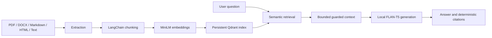

# Production-Minded RAG Pipeline

An end-to-end Retrieval-Augmented Generation pipeline for question answering
over business documents. The project uses LangChain, Hugging Face models, and a
persistent local Qdrant vector store to turn PDF, DOCX, Markdown, HTML, and text
files into grounded answers with deterministic source citations.

The implementation starts with a local, reproducible baseline while preserving
the contracts needed to evolve toward hosted models, production APIs,
evaluation, observability, and enterprise data sources.

## Development Approach

This project was developed using AI-assisted software engineering with Codex. I
used AI as a development partner for implementation support while defining the
architecture, requirements, tests, and design decisions myself. All generated
code was reviewed, adapted, and validated through automated tests.

## Highlights

- Multi-format ingestion and extraction for PDF, DOCX, Markdown, HTML, and text
- Configurable recursive chunking with page and character-level provenance
- Local normalized MiniLM embeddings through LangChain
- Persistent Qdrant storage with deterministic IDs and idempotent upserts
- Collection compatibility checks for embedding model, vector dimension,
  distance metric, and schema version
- Ranked semantic retrieval with configurable top-k and score thresholds
- Tokenizer-bounded local generation with explicit abstention behavior
- Deterministic citations built from retrieval metadata, never model output
- Typed configuration, stage-specific exceptions, and automated tests

## Architecture



## Engineering Decisions

| Decision | Production rationale |
| --- | --- |
| Preserve provenance during extraction and chunking | Citations cannot be reconstructed reliably after metadata is lost. |
| Use deterministic chunk IDs | Re-indexing updates logical chunks instead of creating duplicates. |
| Record collection model and dimension | Incompatible query vectors fail before corrupting retrieval behavior. |
| Skip generation without evidence | Avoids unnecessary inference and unsupported answers. |
| Budget the complete prompt with the model tokenizer | Prevents input overflow while keeping citations aligned with the exact evidence sent. |
| Build citations outside the LLM | Prevents fabricated filenames, pages, and source identifiers. |
| Keep provider boundaries behind LangChain interfaces | Makes later model and infrastructure changes less invasive. |

## Quick Start

Requirements:

- Python 3.11 or newer
- [uv](https://docs.astral.sh/uv/)

Install the locked environment:

```powershell
uv sync
```

Index one file or an entire directory:

```powershell
uv run python -m rag_pipeline index path/to/documents
```

Ask a question against the persisted collection:

```powershell
uv run python -m rag_pipeline answer "Which vector database does this project use?"
```

Use separate collection names for unrelated corpora. For example, index an
expense-policy corpus with `--collection-name expense_policies` and pass the
same option to `retrieve` and `answer`; local Qdrant collections persist across
commands.

The first embedding and generation runs download the configured Hugging Face
model weights. Public local models do not require an API key.

## Example Output

```text
Answer:
The project uses a persistent local Qdrant vector store.

Sources:
[1] README.md (chunk 3, characters 1740-2050)
    The local prototype stores vectors in Qdrant under .rag_data/qdrant...
```

Citation records also retain the stable chunk ID, retrieval rank, and retrieval
score for programmatic use. Scores are intentionally not presented as answer
confidence values.

## CLI Workflow

```powershell
# Inspect supported commands
uv run python -m rag_pipeline -h

# Load supported documents
uv run python -m rag_pipeline ingest path/to/documents

# Inspect chunk counts
uv run python -m rag_pipeline chunk path/to/documents

# Verify local embedding output
uv run python -m rag_pipeline embed path/to/documents

# Build or update the persistent Qdrant collection
uv run python -m rag_pipeline index path/to/documents

# Inspect ranked evidence without generation
uv run python -m rag_pipeline retrieve "What is the policy?" --top-k 3

# Retrieve evidence and generate a cited answer
uv run python -m rag_pipeline answer "What is the policy?" --top-k 3
```

Useful options include:

- `--model` and `--model-revision` for the embedding model
- `--generation-model` and `--generation-model-revision` for the local LLM
- `--device` and `--generation-device` for CPU or CUDA placement
- `--top-k` and `--score-threshold` for retrieval behavior
- `--max-input-tokens` for an optional limit below the tokenizer model maximum
- `--max-context-characters` as a secondary generation context guard
- `--collection-name` and `--store-path` for Qdrant persistence

## Local Baseline

The default embedding model is
`sentence-transformers/all-MiniLM-L6-v2`, producing 384-dimensional normalized
vectors. The default generation model is `google/flan-t5-small`, selected as a
small architectural baseline rather than a production-quality answer model.

Transformers is pinned below version 5 because the current LangChain T5 adapter
uses the `text2text-generation` pipeline API. Model revisions can be pinned
independently for reproducible indexing and generation.

Generation counts the exact rendered prompt with the selected tokenizer,
including special tokens, and reserves an eight-token safety margin below the
model limit. The Hugging Face pipeline also enables truncation as a final guard,
although application-level budgeting remains authoritative so citation ranges
stay accurate.

The `answer` command defaults to a cosine score threshold of `0.20` and abstains
when no chunk meets it. The `retrieve` command intentionally has no default
threshold so retrieval scores can be inspected during evaluation. Similarity
thresholds are model- and corpus-specific and should be calibrated rather than
treated as confidence scores.

## Testing

Run the complete suite:

```powershell
uv run python -m unittest discover -s tests -v
```

The suite currently contains 56 tests covering ingestion, extraction, chunking,
embedding contracts, persistent indexing, semantic retrieval, guarded
generation, deterministic citations, and CLI integration. Provider calls use
LangChain test doubles where appropriate; the local model path has also been
verified end to end with MiniLM, Qdrant, and FLAN-T5.

## Project Layout

```text
.
|-- src/
|   `-- rag_pipeline/
|       |-- __main__.py
|       |-- citations.py
|       |-- chunking.py
|       |-- embeddings.py
|       |-- exceptions.py
|       |-- extraction.py
|       |-- generation.py
|       |-- ingestion.py
|       |-- retrieval.py
|       `-- vector_store.py
|-- tests/
|   |-- test_citations.py
|   |-- test_chunking.py
|   |-- test_embeddings.py
|   |-- test_extraction.py
|   |-- test_generation.py
|   |-- test_ingestion.py
|   |-- test_package.py
|   |-- test_retrieval.py
|   `-- test_vector_store.py
|-- ARCHITECTURE.md
|-- PROJECT_BRIEF.md
|-- ROADMAP.md
|-- pyproject.toml
`-- uv.lock
```

## Current Limitations

- Retrieval is dense-only; hybrid search and reranking are roadmap items.
- The default retrieval threshold is a conservative safety baseline pending
  calibration against an evaluation dataset.
- Citations identify the evidence supplied to the model but are not yet mapped
  to individual answer claims.
- Local source paths should become stable document IDs or authorized URLs before
  citations are exposed through a service.
- The default generation model prioritizes local accessibility over answer
  quality and throughput.

## Roadmap

The staged roadmap covers retrieval-quality experiments, evaluation datasets,
benchmarking, a FastAPI service, authentication, monitoring, containerization,
CI/CD, permissions-aware retrieval, and multi-tenant enterprise integrations.
See [ROADMAP.md](ROADMAP.md) for the full sequence.
