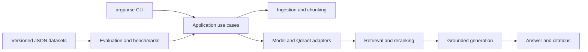

# Technical Manual

This manual is the implementation-level inventory for the RAG pipeline. It
explains which technologies are currently used, where each one fits, and which
trade-offs or limitations matter in a production discussion.

- **Project version:** 0.2.0
- **Last verified:** 2026-08-13
- **Current product surface:** Local Python CLI

## How To Read Version Information

The repository has three different version concepts:

1. `pyproject.toml` declares supported dependency ranges and the minimum Python
   version.
2. `uv.lock` records the exact reproducible dependency graph used by local
   development and CI.
3. Model identifiers and optional model revisions are runtime configuration,
   independent of Python package versions.

The locked versions below are a snapshot, not a second dependency source.
Always change constraints in `pyproject.toml` and refresh `uv.lock` with
`uv lock`.

## Stack At A Glance

| Area | Technology | Responsibility in this project |
| --- | --- | --- |
| Language | Python 3.11+ | Implements the CLI, application services, RAG stages, validation, and tests. |
| RAG contracts | LangChain | Supplies common document, embedding, prompt, model, parser, and vector-store interfaces. |
| CLI | `argparse` | Defines all commands, options, validation handoff, and terminal entry points without an extra CLI framework. |
| Dense embeddings | LangChain Hugging Face + Sentence Transformers | Converts chunks and questions into normalized dense vectors for semantic search. |
| Sparse embeddings | FastEmbed through LangChain Qdrant | Produces BM25 sparse vectors for optional lexical retrieval. |
| Generation | Hugging Face Transformers through LangChain | Runs a local text-to-text model for grounded answer generation. |
| Reranking | Sentence Transformers CrossEncoder | Jointly scores query and chunk pairs after first-stage retrieval. |
| Vector storage | Embedded Qdrant | Persists vectors and metadata and executes dense or hybrid similarity search. |
| Text splitting | LangChain Text Splitters | Provides recursive and Markdown-aware hard boundaries for chunks. |
| PDF extraction | pypdf | Extracts one provenance-bearing document per PDF page. |
| DOCX extraction | docx2txt | Extracts a Word document as one logical text document. |
| Data contracts | JSON and Markdown | Store synthetic corpora, evaluation labels, benchmark artifacts, and human-readable reports. |
| Evaluation | Project-owned Python | Computes deterministic retrieval, answer, abstention, citation, latency, and regression metrics. |
| Dependency management | uv | Creates the environment, resolves and locks dependencies, runs tools, and builds packages. |
| Packaging | setuptools | Builds the typed `src`-layout package as a wheel and source distribution. |
| Tests | `unittest` | Runs deterministic unit and local integration tests without network access. |
| Formatting and linting | Ruff | Enforces formatting, imports, naming, correctness, and selected performance rules. |
| Static typing | mypy | Checks all production modules in strict mode. |
| Coverage | Coverage.py | Measures branch coverage and enforces an 80 percent minimum. |
| CI | GitHub Actions | Repeats locked installation, quality checks, tests, coverage, and package builds on pull requests and `main`. |
| Version control | Git and GitHub | Provide reviewable branch history, pull requests, release tags, and benchmark commit provenance. |

## Direct Dependencies

These are the runtime dependencies declared by the project. The locked snapshot
reflects `uv.lock` as verified on the date at the top of this document.

| Package | Declared range | Locked | Why it exists |
| --- | --- | --- | --- |
| `langchain` | `>=1.0,<2.0` | 1.3.13 | Declares the LangChain framework family used by the pipeline. |
| `langchain-huggingface` | `>=1.2,<2.0` | 1.2.2 | Adapts local Hugging Face embedding and generation models to LangChain contracts. |
| `langchain-qdrant` | `>=1.1,<2.0` | 1.1.0 | Connects LangChain retrieval contracts to Qdrant and exposes FastEmbed sparse embeddings. |
| `langchain-text-splitters` | `>=1.0,<2.0` | 1.1.2 | Supplies recursive character and language-aware splitters. |
| `qdrant-client` | `>=1.18,<2.0` | 1.18.0 | Runs the embedded Qdrant database and its query/filter API. |
| `sentence-transformers` | `>=5.2,<6.0` | 5.6.0 | Provides the dense embedding backend and cross-encoder reranker. |
| `sentencepiece` | `>=0.2,<1.0` | 0.2.2 | Supports tokenization for the default T5-family generation model. |
| `transformers` | `>=4.48,<5.0` | 4.57.6 | Loads the local text-to-text generation pipeline and tokenizer. |
| `fastembed` | `>=0.3.3,<1.0` | 0.8.0 | Executes the optional local BM25 sparse model. |
| `pypdf` | `>=6.0,<7.0` | 6.14.2 | Reads text and page metadata from PDFs. |
| `docx2txt` | `>=0.9,<1.0` | 0.9 | Reads text from DOCX files. |

The code imports `langchain_core` contracts directly; that package is currently
resolved through the declared LangChain family. The behaviorally important
transitive runtime snapshot is:

| Package | Locked | Runtime role |
| --- | --- | --- |
| `langchain-core` | 1.4.9 | Defines the document, embedding, prompt, model, parser, and runnable contracts imported by project code. |
| `torch` | 2.13.0 | Executes Sentence Transformers and Hugging Face model inference on CPU or CUDA. |
| `numpy` | 2.5.1 | Supplies array operations used by the ML provider stack and provider score outputs. |
| `tokenizers` | 0.22.2 | Provides optimized Hugging Face tokenization where supported by a model. |
| `onnxruntime` | 1.27.0 | Executes FastEmbed's local ONNX models. |

These packages are locked in `uv.lock` rather than maintained as independent
application APIs. The full transitive graph contains additional implementation
dependencies and can be inspected with `uv tree`.

Development tools are deliberately pinned exactly:

| Package | Version | Enforced behavior |
| --- | --- | --- |
| `ruff` | 0.16.1 | Formatting plus configured lint rule families. |
| `mypy` | 2.3.0 | Strict type checking under `src/rag_pipeline`. |
| `coverage[toml]` | 7.15.2 | Branch coverage with `fail_under = 80`. |

## Architecture And Ownership



| Package | Ownership |
| --- | --- |
| `rag_pipeline.cli` | Parses terminal input, maps arguments to typed configuration, invokes services, and renders output. |
| `rag_pipeline.application` | Coordinates transport-neutral indexing and retrieval lifecycles. |
| `rag_pipeline.ingestion` | Discovers files, extracts text, creates chunks, and runs chunking experiments. |
| `rag_pipeline.infrastructure` | Owns dense/sparse model adapters and Qdrant persistence. |
| `rag_pipeline.retrieval` | Defines retrieval policy, metadata filters, result provenance, and reranking. |
| `rag_pipeline.generation` | Owns prompt construction, token budgeting, model invocation, abstention, and citations. |
| `rag_pipeline.evaluation` | Loads labeled datasets and calculates deterministic retrieval and answer metrics. |
| `rag_pipeline.benchmarking` | Rebuilds isolated pipelines, records provenance and timing, compares artifacts, and enforces thresholds. |
| `rag_pipeline.exceptions` | Provides stage-specific errors shared across package boundaries. |

This is a layered modular monolith. The CLI is the only transport, while the
application and feature services remain reusable by a future API. Provider
details are kept at explicit boundaries instead of being spread through command
handlers.

## RAG Execution Flow

### 1. Discovery And Extraction

`pathlib` handles local paths and recursive discovery. Extractors normalize all
supported files to LangChain `Document` objects:

- `.pdf`: pypdf emits one document per page so citations retain page identity.
- `.docx`: docx2txt emits one logical document because Word pagination depends
  on rendering settings.
- `.txt`, `.md`, `.markdown`, `.html`, and `.htm`: Python reads the file as
  UTF-8 text by default. Markup is retained rather than semantically parsed.

Metadata includes the resolved source path, filename, extension, byte size,
extractor, and page information where available. The current implementation
does not perform OCR, table extraction, image understanding, or HTML cleanup.

### 2. Chunking

The default strategy wraps LangChain's `RecursiveCharacterTextSplitter` and
preserves source metadata plus character offsets. Optional structure-aware
Markdown splitting keeps heading context where possible.

Semantic chunking is project-owned logic built on LangChain `Embeddings`. It
embeds buffered sentence windows, calculates adjacent cosine distances, and
places candidate boundaries above a configured percentile. Recursive splitting
still enforces hard maximum sizes, which prevents semantic grouping from
creating model-breaking chunks.

Trade-off: smaller chunks improve retrieval precision but may lose context;
larger or overlapping chunks improve continuity but increase embedding work,
storage, and prompt usage. Semantic chunking can improve topical coherence but
adds an embedding pass during ingestion, so it remains opt-in and benchmarked.

### 3. Dense Embeddings

The default dense model is
`sentence-transformers/all-MiniLM-L6-v2`. It produces 384-dimensional vectors,
runs on CPU by default, embeds documents in batches of 32, and normalizes
vectors for cosine search. The CLI configures model name, optional revision,
device, and batch size. Programmatic configuration can also disable
normalization, while current CLI workflows retain the normalized default.

`EmbeddingService` validates input text, provider result counts, numeric values,
finite values, and stable vector dimensions. Index and query paths share this
contract so model drift fails early instead of corrupting a collection.

Trade-off: MiniLM is small and accessible for local development, but a
production corpus may require a domain-specific or multilingual embedding model
validated against representative retrieval labels.

### 4. Sparse Embeddings And Hybrid Search

Hybrid mode adds FastEmbed's `Qdrant/bm25` sparse model. Sparse vectors capture
exact terms that dense semantic vectors may underweight, including identifiers,
names, and policy phrases. The default cache is `.rag_data/fastembed`, the
default batch size is 256, and CPU thread count is optional.

Qdrant fuses dense and sparse rankings with Reciprocal Rank Fusion (RRF). RRF
combines rank positions rather than incomparable cosine and BM25 raw scores. An
empty sparse query vector falls back to dense retrieval.

Trade-off: hybrid search can improve lexical recall, but it adds model storage,
index size, ingestion time, and another collection compatibility contract. The
default BM25 model's tokenization and stemming also need corpus-specific review.

### 5. Vector Storage And Indexing

`qdrant-client` runs Qdrant in embedded local mode:

- Persistent path: `.rag_data/qdrant`
- Default collection: `rag_documents`
- Distance metric: cosine for dense vectors
- Schemas: version 1 for dense and version 2 for hybrid collections
- Writes: synchronous, validated, and batched
- Identity: deterministic UUID-based point IDs for idempotent upserts

The collection contract records and validates schema version, model identity,
vector dimension, named-vector layout, distance metric, and sparse settings.
Incompatible indexing or retrieval fails explicitly rather than mixing vectors
with different semantics.

The standard-library `sqlite3` module is used only to configure embedded
Qdrant's thread-safety behavior. The application has no separate SQL schema or
relational persistence layer.

Trade-off: embedded Qdrant keeps the prototype self-contained and exercises a
real vector database API. A multi-user production service would normally use a
separately operated Qdrant deployment with backups, authentication, encryption,
capacity planning, and availability controls.

### 6. Retrieval And Filtering

The retriever embeds the query with the same dense model contract used during
indexing. It supports:

- Dense cosine retrieval
- Optional dense plus BM25 hybrid retrieval
- Configurable `top_k` and candidate overfetch
- Optional minimum score threshold
- Repeatable exact scalar metadata filters with AND semantics
- Stable rank, score type, source metadata, and first-stage provenance

Metadata filters are translated to Qdrant conditions before top-k selection.
This is important for both relevance and future authorization because excluded
documents never enter the candidate set. Current filters are technical query
filters, not a complete RBAC or tenant-isolation implementation.

### 7. Cross-Encoder Reranking

The optional reranker uses
`cross-encoder/ms-marco-MiniLM-L6-v2` through Sentence Transformers. Unlike a
bi-encoder, it processes each query and candidate together, which usually gives
better ordering at higher inference cost.

Defaults are CPU execution, batch size 16, maximum pair length 512 tokens, and
cache path `.rag_data/rerankers`. First-stage ranks and scores remain attached
after reranking for auditability. Candidate width must be bounded because
latency grows approximately with the number of scored query-document pairs.

### 8. Prompting And Generation

The default generation model is `google/flan-t5-small`, loaded as a local Hugging
Face `text2text-generation` pipeline. LangChain composes a versioned
`PromptTemplate`, `BaseLanguageModel`, and `StrOutputParser` using its runnable
pipeline syntax.

Defaults are CPU execution, 128 maximum new tokens, deterministic decoding at
temperature 0, and a single-item generation batch. The application measures the
fully rendered prompt with the provider tokenizer, applies the configured input
limit, and reserves a safety margin before inference.

Only retrieved evidence that fits both character and token budgets enters the
prompt. With no usable evidence, generation is skipped and the exact abstention
response is returned. Citations are constructed deterministically from the same
accepted evidence and its metadata, never generated by the model.

Trade-off: FLAN-T5 Small makes the complete pipeline runnable on a CPU, but it
is a functional baseline rather than a production-quality answer model.

## Evaluation And Benchmarking

Evaluation is implemented in project-owned, deterministic Python rather than a
hosted judge model or an evaluation framework such as Ragas.

Retrieval evaluation uses versioned JSON datasets and reports per-case and macro
Precision@k, Recall@k, reciprocal rank, and MRR. Schema-v2 relevance labels use
source metadata and content anchors instead of unstable chunk indices.

Answer evaluation reports normalized exact match, token F1, abstention accuracy,
abstention precision/recall, answer rate, and citation-behavior rate. These are
repeatable lexical and behavioral checks; they do not prove semantic
faithfulness or business correctness.

The benchmark runner rebuilds a temporary index from an exact corpus and records:

- Input, dataset, threshold-profile, and configuration fingerprints
- Package, platform, Python, Git, device, CUDA, and model provenance
- Stage duration plus per-case retrieval and answer latency
- Mean, p50, and p95 latency summaries
- Retrieval and answer quality metrics
- Index storage size and total runtime
- Compatible-run deltas and allowlisted regression gates

Benchmarks are one local measured pass. They are useful for reproducible
development comparisons but are not load tests and do not include warmups,
concurrency, confidence intervals, memory peaks, or hosted-provider costs.

## CLI And Configuration

The CLI uses only Python's `argparse`. The installed console script and module
entry point are equivalent:

```powershell
uv run rag-pipeline --help
uv run python -m rag_pipeline --help
```

Current commands are:

| Command | Purpose |
| --- | --- |
| `ingest` | Discover supported files and extract normalized documents. |
| `chunk` | Extract and split documents with the configured chunking policy. |
| `chunk-experiment` | Compare candidate recursive chunking configurations. |
| `embed` | Generate and validate dense chunk vectors. |
| `index` | Build or update a compatible dense or hybrid Qdrant collection. |
| `retrieve` | Search the collection with filters and optional reranking. |
| `answer` | Retrieve evidence and generate a grounded answer with citations. |
| `evaluate-retrieval` | Run labeled retrieval cases and report top-k metrics. |
| `evaluate-answer` | Run reference and abstention cases through the full answer path. |
| `benchmark` | Rebuild and measure an isolated end-to-end pipeline. |
| `compare-benchmarks` | Compare compatible artifacts and regression thresholds. |

Configuration is currently supplied through CLI flags and typed immutable
dataclasses. There is no active `.env` model-provider configuration on `main`,
and the current generation and embedding paths are local model providers.

## Local State And I/O

| Path or format | Content | Repository policy |
| --- | --- | --- |
| `.rag_data/qdrant` | Embedded vector database | Ignored by Git |
| `.rag_data/fastembed` | Sparse model cache | Ignored by Git |
| `.rag_data/rerankers` | Cross-encoder cache | Ignored by Git |
| Hugging Face cache | Dense and generation model artifacts | Managed outside tracked source |
| `evaluation/datasets` | Synthetic Markdown corpus and versioned JSON labels | Tracked |
| Benchmark JSON artifacts | Configuration, provenance, metrics, and timings | Written only when requested |
| Local `.env` files | Potential secrets | Ignored by default; `.env.example` is the only allowed exception, and no active provider contract exists on `main` |

Model factories may download artifacts on first use. After caches are populated,
the pipeline runs locally without an API key. Default automated tests use stubs
and in-memory or temporary storage, so they require neither downloads nor
network access.

## Engineering Toolchain

### Dependency And Environment Management

uv is the single workflow for synchronization, execution, locking, and builds:

```powershell
uv sync --locked --dev
uv run rag-pipeline --version
uv lock --check
uv build
```

`pyproject.toml` is the editable dependency and package metadata source.
`uv.lock` is committed for reproducibility. The application version is read
from installed distribution metadata through `importlib.metadata`.

### Packaging

setuptools uses a `src` layout to prevent imports from accidentally resolving
against the repository directory. The package publishes a `py.typed` marker for
PEP 561 typing support and builds both wheel and source distributions.

### Tests And Quality Gates

The default suite uses standard-library `unittest`. Test doubles isolate model
providers, while temporary embedded Qdrant instances cover persistence and
retrieval integration deterministically.

```powershell
uv run ruff format --check .
uv run ruff check .
uv run mypy
uv run coverage run -m unittest discover -s tests
uv run coverage report
uv build
```

Ruff targets Python 3.11 and an 88-character line length. Mypy checks production
source in strict mode. Coverage measures branches and fails below 80 percent.

### Continuous Integration

GitHub Actions runs on pull requests and pushes to `main` with read-only
repository permissions, concurrency cancellation, and a 30-minute timeout. The
quality job uses Ubuntu, Python 3.11, uv 0.11.32, locked dependencies, Ruff,
mypy, `unittest`, branch coverage, and package builds.

The package advertises Python 3.11, 3.12, and 3.13 classifiers, but CI currently
executes only Python 3.11. Additional matrix jobs would be required to claim
continuous verification on every advertised interpreter.

## Deliberately Project-Owned Logic

LangChain provides interfaces and focused adapters, but the following behavior
remains explicit project code:

- File discovery and provenance normalization
- Provider response and vector validation
- Semantic breakpoint selection and hard chunk bounds
- Deterministic point identity and collection compatibility
- Metadata filter parsing and retrieval result provenance
- Reranking tie-breaking and score lineage
- Prompt token budgeting, abstention, and citation assembly
- Evaluation schemas, metrics, benchmark provenance, and regression gates

This keeps important business safeguards reviewable and testable instead of
hiding the entire application behind an opaque chain or agent abstraction.

## Not In The Current Stack

The following technologies or capabilities are not implemented on `main` and
must not be presented as current behavior:

- FastAPI, REST endpoints, or an HTTP service
- Pydantic request/response schemas owned by this project
- OpenAI, Gemini, Claude, or other hosted model providers
- API-key loading from `.env`
- MCP servers, tool calling, or autonomous agents
- RBAC, authentication, tenant isolation, or authorization policy enforcement
- Docker, Kubernetes, cloud deployment, or a remote Qdrant cluster
- Distributed workers, queues, schedulers, or streaming ingestion
- Production telemetry, tracing, dashboards, or alerting
- OCR, scanned-document understanding, or multimodal extraction
- LLM-as-a-judge, Ragas, or human evaluation workflows

These are valid production-evolution topics, but documenting them separately
prevents roadmap intent from being confused with delivered functionality.

## Maintenance Checklist

Review and update this manual after each coding task when that task changes any
of the following:

- Python support, direct dependencies, locked versions, or build backend
- Default models, model providers, revisions, devices, caches, or inference
  behavior
- File formats, chunking, embedding, storage, retrieval, reranking, prompting,
  generation, evaluation, or benchmark behavior
- CLI commands, configuration sources, APIs, authentication, or deployment
  surfaces
- Package ownership, data flow, persistent paths, schemas, or external I/O
- Test framework, quality thresholds, CI environment, or release process

For an affected change:

1. Inspect `pyproject.toml`, `uv.lock`, the changed implementation, and
   `.github/workflows/ci.yml` as applicable.
2. Update the relevant section and the `Last verified` date.
3. Keep implemented behavior separate from roadmap plans.
4. Check consistency with `README.md`, `ARCHITECTURE.md`, and
   `CONTRIBUTING.md`.
5. Include the manual update in the same pull request as the technical change.

Pure internal edits that do not change any documented fact do not require
wording churn. The review should still confirm that the manual remains accurate.
